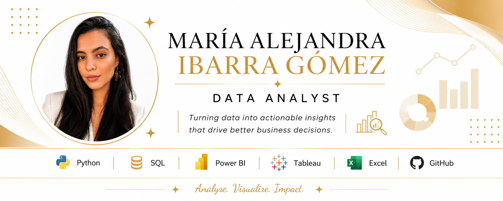

  

<h1 align="center">Hi 👋, I'm María Alejandra Ibarra Gómez</h1>
<h3 align="center">Data Analyst | Python | SQL | Power BI | Tableau</h3>

Passionate about transforming data into meaningful insights that support business decisions.

---

## 👩‍💻 About Me

- 📊 Data Analyst passionate about solving problems through data.
- 🌱 Currently expanding my skills in Python, SQL, Power BI, Tableau and Machine Learning.
- 🎯 Interested in Business Intelligence, Data Analytics and Data Visualization.
- 💼 Open to Data Analyst opportunities.

---

## 🚀 Technologies & Tools

**Data Analysis**

- Python
- Pandas
- NumPy
- SQL
- Power BI
- Tableau
- Matplotlib
- Seaborn
- Scikit-learn
- Excel

---

## 📂 Featured Projects

- 🧹 Data Preprocessing with Python
- 👥 Customer Data Cleaning
- 🎵 Music Streaming Data Analysis
- 🛒 Instacart Data Analysis

🚀 More projects coming soon...

---

## 📫 Contact

📧 **Email:** mariaa6932@gmail.com

💼 **LinkedIn:**  
www.linkedin.com/in/maria-alejandra-ibarra-gomez

🐙 **GitHub:**  
github.com/Aleja0812

---

⭐ *"Turning data into actionable insights through analysis and visualization."*
